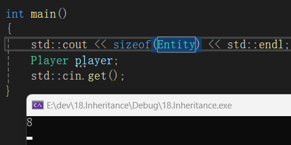
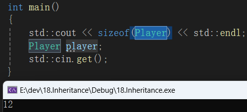

继承（Inheritance）

面向对象是一个非常非常大的编程范式，类的继承是其中最基本的一个概念，是我们可以利用的最强大的特性之一。

继承使类之间有了相关互联的层级关系，换句话说，它使我们拥有一个包含通用功能的积累，然后从这个最开始的父类中可以创建出更多的派生类。这就是继承为什么非常有用，因为它可以帮助我们避免写很多重复的代码，代码重复（code duplication)是指我们必须多次地写相同的代码，或者代码略微不同但实际上是在做同样的事，为了避免一次次地重复，我们可以把所有通用的功能放在一个父类中，然后很容易地从基类（父类）中创建派生类（子类）

Ps:其实本质和include差不多就是复制粘贴

代码实战，假如我有一个Entity类，然后它将控制游戏里的所有Entity实例，在游戏里有非常非常具体的Entity，但是在某些方面他们会共享功能。

```
#include <iostream>

class Entity
{
public:
	//比如说游戏里每个Entity都有用2个浮点数来表示位置属性
    float X,Y;
    
    //然后我们想给每个Entity移动的能力
    void Move(float xa,float ya)//参数为xa和ya，用来表示我们想要移动的量
    { 
    	X += xa ; //取出当前对象的 X 值,加上参数 xa,再把结果存回 X
    	Y += ya ;
    };
};//我们有了一个Entity基类（父类），可以说游戏里创建的每个Entity实例都有具体的特性，我们创建个新类型的Entity,比如说Player

class player
{
	//编写我们的Player类，目前为止还没有用到继承的概念，如果从头开始的话，我们会想Player也有一个位置属性
public:
	//Player类可能会包含一些其他的数据，比如说名字
	const char* Name;
    float X,Y;  
    void Move(float xa,float ya)
    { 
    	X += xa ; 
    	Y += ya ;
    };
    void PrintName()
    {
    	std::cout<<Name<<std::endl;
    }
};

int main()
{
	std::cin.get();
}
```

好了现在要把Player变成Entity的派生类（子类），应该这么做

```
class Player ：public Entity
{

public:
	const char* Name;
    float X,Y;  
    void Move(float xa,float ya)
    { 
    	X += xa ; 
    	Y += ya ;
    };
    void PrintName()
    {
    	std::cout<<Name<<std::endl;
    }

};
```

在类型声明后面写上冒号，然后写上public Entity

写下代码之后，发生了一些事情，Player类不再仅仅只是Player类型，也是Entity类型，它同时是两种类型，另一件事就是Player现在拥有了Entity的一切，所有的类成员X和Y，还有浮点数xa ya，都包含在Player里，所以目前Player中实际上有4个浮点数了，接下来我们要把重复的代码删除，所以Player类中只有新代码了，Entity里有的则要去除掉，所以代码变成了

```
class Player ：public Entity
{

public:
	const char* Name;
    
    void PrintName()
    {
    	std::cout<<Name<<std::endl;
    }

};
```

 

关于Player类看起来很干净，实际上还是Entity，意味着我们看Player并不能得知Entity全貌，我们必须往上翻到Entity类里去看看有什么，对于Player类来说，再Entity类中的函数全都是公开（public）的成员，没有私有的（private）成员，Player类都可以访问到，让我们来试验一下

```{
int main()
{
	Player player;
	player.PrintName():
	std::cin.get();
}
```

 假设我再这里创建一个Player实例（对象），我不但可以调用再Player类中定义的PrintName函数，也能调用Entity中的Move函数，还可以访问X和Y，就像我在使用一个Entity的实例（对象）一样，因为它继承了Entity所有的功能。

```
int main()
{
    Player player;
    player.Move(5, 5);//传入我要移动的参数
    player.X = 2;//访问X
    player.PrintName();
    std::cin.get();
}
```

继承是用来扩展现有的类和为基类提供新功能的一种方式，它是面向对象变成的一个最重要的东西。

**记住当你创建了一个子类，它会包含父类的一切**

证明这些的最好方法就是，我们Entity中有两个浮点数X和Y

让我们接着把Entity对象的size打印到控制图，可以使用sizeof(Entity)

```
int main()
{
    std::cout<<sizeof(Entity)<<std::endl;
    Player player;
    std::cin.get();
}
```

运行代码，你会看到size是8，因为在Entity里我们有两个Float变量X和Y。Float占用4字节(32位） 所以是8。



我们接下来继续打印sizeof(Player)如果Player不是从Entity扩展来的，如果Player只有它自己的内容，那它应该只有这个const chat*,在32位应用中占4个字节内存，但既然我们是从Entity类中扩展来的，意味着它继承了Entity类的所有变量，那就应该是4+4+4=12，占12个字节

```
int main()
{
    std::cout << sizeof(Player) << std::endl;
    Player player;
    std::cin.get();
}
```



确实是继承了Entity类的一切，就像我一开始说的，本质和include差不多就是复制粘贴Player类就是增加额外功能的Entity类，记住这些类的大小和内存实际上是可变化的，如果我们重新写Player类里的函数，那么就要去维护一个vrable(虚函数表)，这也需要占用额外的内存，关于面向对象编程的独立概念，多态，继承，重载这些东西都是单独和深入的

To me :别人能想出来的我也一定能想出来， 计算机没有任何黑魔法，所有东西只不过是我现在不知道而已，总有一天我会把所有的细节，所有的内部的东西全都搞明白，函数里面到底是怎么做事情的，只不过刚开始学习，还没来得及看原始的代码是怎么样的，一切不过是个函数，也不过是某个人给他写出来的，那个人和我一样，同样只有一个脑袋而已